# Testudo Trading Platform - System Architecture

## 📐 C4 Model Architecture Documentation

This document provides a comprehensive view of the Testudo Trading Platform architecture using the C4 model methodology, ensuring clear understanding from high-level context down to detailed components.

---

## 🌍 Level 1: System Context Diagram

Shows how Testudo fits into the world around it - users and external systems.

---

## 🏢 Level 2: Container Diagram

Shows the high-level shape of the system architecture and how responsibilities are distributed.

---

## ⚙️ Level 3: Component Diagram - Trading Core

Shows the detailed components within the Trading Core container.

---

## 🧮 Level 3: Component Diagram - Risk Engine

Shows the detailed components within the Risk Engine container.

---

## 🗄️ Data Architecture Diagram

Shows the data flow and storage architecture.

---

## 🔄 OODA Loop Implementation Architecture

```mermaid
sequenceDiagram
    participant UI as Frontend UI
    participant API as API Server
    participant OBS as Observer
    participant ORI as Orientator  
    participant DEC as Decider
    participant EXE as Executor
    participant EXC as Exchange
    
    UI->>API: Drag trade setup
    API->>OBS: Start OODA loop
    
    Note over OBS: OBSERVE Phase
    OBS->>EXC: Get market data
    EXC-->>OBS: Price feeds
    
    Note over ORI: ORIENT Phase  
    OBS->>ORI: Market conditions
    ORI->>ORI: Calculate position size (Van Tharp)
    ORI->>ORI: Analyze risk/reward
    
    Note over DEC: DECIDE Phase
    ORI->>DEC: Proposed trade
    DEC->>DEC: Validate against Testudo Protocol
    DEC->>DEC: Check account limits
    
    Note over EXE: ACT Phase
    DEC->>EXE: Execute approved trade
    EXE->>EXC: Place order
    EXC-->>EXE: Order confirmation
    EXE->>API: Update position
    API->>UI: Reflect changes
```

---

## 🏛️ Deployment Architecture

---

## 🔐 Security Architecture

---

## 📊 System Integration Patterns

### Event-Driven Architecture

### Circuit Breaker Pattern

---

## 🎯 Architecture Decision Records (ADRs)

### ADR-001: Monolithic vs Microservices
**Decision**: Monolithic Rust application  
**Rationale**: 
- Target scale (100-1000 users) doesn't justify microservices complexity
- Lower latency requirements favor single-process architecture
- Simpler deployment and debugging
- Team expertise concentrated in Rust

### ADR-002: Database Choice
**Decision**: PostgreSQL + TimescaleDB  
**Rationale**:
- ACID compliance crucial for financial data
- TimescaleDB excellent for time-series trade data
- Strong Rust ecosystem support (sqlx)
- Familiar operational requirements

### ADR-003: Real-time Communication
**Decision**: WebSockets over Server-Sent Events  
**Rationale**:
- Bidirectional communication needed for order updates
- Better browser support and debugging tools
- Aligns with trading platform expectations
- Easier state synchronization

### ADR-004: Frontend Framework
**Decision**: Progressive Web App (React/TypeScript)  
**Rationale**:
- Balances performance with accessibility requirements
- Better reach than native desktop app
- TradingView integration more straightforward
- Can evolve to native wrapper if needed

---

## 📈 Scalability Considerations

### Horizontal Scaling Strategy
1. **Database**: Read replicas for analytics queries
2. **Cache**: Redis Cluster for high availability  
3. **Application**: Multiple instances behind load balancer
4. **CDN**: Global static asset distribution

### Performance Optimization
1. **Database**: Proper indexing and query optimization
2. **Cache**: Aggressive caching of market data and calculations
3. **WebSocket**: Connection pooling and message compression
4. **Frontend**: Code splitting and lazy loading

### Monitoring & Observability
1. **Metrics**: Custom Prometheus metrics for trading operations
2. **Logging**: Structured logging with correlation IDs
3. **Tracing**: Distributed tracing for request flows
4. **Alerts**: Automated alerting on error rates and latency

---

*"Architecture is the art of how to waste space beautifully." - In Testudo, we waste no computational cycles, and every component serves the discipline of systematic trading.*

**Document Version**: 1.0  
**Last Updated**: 2025-08-30  
**Review Status**: Draft