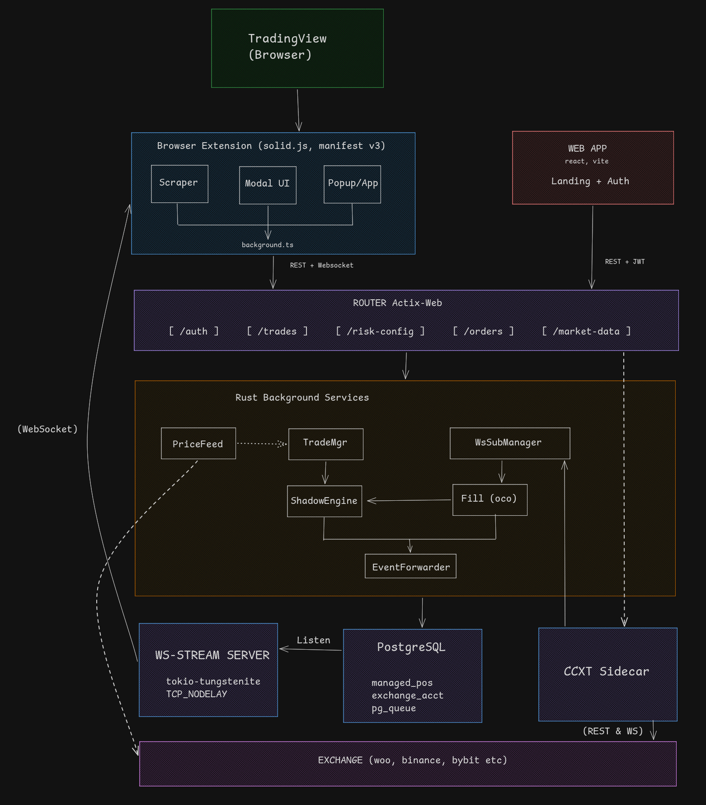

<p align="center">
    
</p>

<p align="center">
    <strong>Risk Management as a Service.</strong> <br />
    A self-hosted trading overlay that validates, sizes, and manages positions across any exchange.
    <br /> <br />
    <a href="#what-it-does"><strong>What It Does</strong></a> ·
    <a href="#architecture"><strong>Architecture</strong></a> ·
    <a href="#the-engine"><strong>The Engine</strong></a> ·
    <a href="#use-cases"><strong>Use Cases</strong></a> ·
    <a href="#tech-stack"><strong>Tech Stack</strong></a> ·
    <a href="#api-endpoints"><strong>API Endpoints</strong></a> ·
    <a href="#local-development"><strong>Local Development</strong></a>
</p>

## What It Does

Testudo is a **risk management layer** that sits between your trading logic and your exchange accounts. Every trade passes through a validation gate before it reaches the exchange — position sizing, margin checks, risk limits — all enforced in-memory before a single order is placed.

The core idea: **separate the decision from the execution.** Your strategy decides *what* to trade. Testudo decides *how much* and *whether it's safe*, then routes the order, monitors the position, and manages exits automatically.

It connects to any exchange via [CCXT](https://github.com/ccxt/ccxt) adapters, so your risk rules follow you across venues.

## Architecture



A trade flows through three stages:

1. **Validation** — The request hits the Router, which runs it through the Decision Loop. The Risk Service checks account exposure, the Position Sizer calculates quantity as `MIN(account%, fixed risk, max size, margin capacity)`, and the Shadow Engine simulates the trade against in-memory state. If any check fails, the trade is rejected before it leaves the server.

2. **Execution** — Validated orders are routed to the target exchange. CEX orders (Binance, Bybit, etc.) pass through the Node.js CCXT sidecar, while Hyperliquid orders are executed natively via the integrated Rust SDK. Entry, stop-loss, and take-profit orders are placed as a linked group with a `clientOrderId` convention (`testudo:{group_id}:{role}`) for tracking.

3. **Management** — Background services take over. The Price Feed polls market data every 2 seconds. The Trade Manager evaluates management rules (break-even, trailing stop, partial take-profit) on each tick. The Fill Detector listens for order fills via WebSocket and handles OCO cancellation (SL fills → cancel TP, and vice versa). All state changes are broadcast to connected clients through PostgreSQL LISTEN/NOTIFY.

If the server restarts, positions are rehydrated from the database and verified against the exchange — no manual recovery needed.

## The Engine

The engine is the core of Testudo. Everything else — the API, the extension, the sidecar — exists to feed trades into it and act on its decisions.

### Shadow Engine

An in-memory representation of all active positions and orders. It uses `RwLock` for the global state and `DashMap` for lock-free per-user balance access. The Shadow Engine serves two purposes:

- **Paper trading** — Full order matching with a BTreeMap orderbook for price-time priority. Place, fill, and cancel orders without touching a real exchange.
- **State tracking** — For live trades, the Shadow Engine mirrors exchange state so the system can make decisions without waiting for API round-trips.

### Decision Loop

Every trade request passes through a single validation gate:

```
Request → Decision Loop → Risk Service → Position Sizer → Shadow Engine → Execute
```

The Decision Loop enforces risk rules that can't be bypassed. The Position Sizer always takes the most conservative result across multiple sizing methods. This is intentional — in a system that manages real money, the safest answer wins.

### Order Groups

Trades aren't individual orders — they're **groups**. An entry order, stop-loss, and take-profit are linked together as an `OrderGroup` with lifecycle tracking:

```
Pending → Active → StoppedOut / TookProfit / Cancelled / Closed
```

When one leg fills, the Fill Detector automatically cancels the sibling. When you cancel a trade, all linked orders are cancelled atomically. Exchange order IDs are indexed for sub-millisecond lookup on fill events.

### Trade Management

Once a position is active, the Trade Manager runs continuously on price ticks:

- **Break-even** — Move stop-loss to entry price when profit reaches a threshold
- **Trailing stop** — Ratchet the stop-loss as price moves in your favor
- **Partial take-profit** — Close a percentage of the position at target levels
- **5-second debounce** — Prevents rapid-fire amendments to the same position

All management actions are persisted to PostgreSQL and broadcast to clients.

## Use Cases

The engine exposes a REST API. Anything that can make HTTP requests can use it.

### Browser Extension (built)
A TradingView overlay that scrapes chart drawings (position tool), calculates risk, and submits trades via Alt+X hotkey. Shows live position status, balances, and fill notifications. This is the primary client today.

### Trading Bots
Connect any algorithmic strategy. The engine handles sizing, risk limits, and position management — your bot just sends entry signals. The API supports multiple concurrent users with isolated risk configs.

### Portfolio Dashboard
The `/trades`, `/exchanges/accounts/{id}/balance`, and `/market-data` endpoints provide everything needed for a real-time portfolio view across exchanges. WebSocket subscriptions deliver live order updates.

### Trading Journal
Historical trade data, management events, and risk decisions are all persisted. The foundation exists for a journaling system that captures not just *what* happened, but *why* — which risk rule sized the position, when break-even triggered, how the trailing stop moved.

### Multi-Strategy Execution
The Decision Loop architecture supports running multiple strategies against the same account with shared risk limits. Each strategy submits trades independently; the engine ensures the aggregate exposure stays within bounds.

## Tech Stack

### Crates

| Crate | Purpose |
|-------|---------|
| **engine** | Shadow Engine, OrderGroups, BTreeMap orderbook, DashMap balances |
| **router** | Actix-web HTTP server, Decision Loop, Risk Service, and native Hyperliquid integration |
| **common_utils** | Position Sizer, risk types, exchange adapters |
| **pg_queue** | PostgreSQL SKIP LOCKED queues + LISTEN/NOTIFY pub/sub + UNLOGGED cache |
| **sqlx_postgres** | Database client and migrations |
| **ws-stream** | WebSocket server (tokio-tungstenite, port 4000) |
| **db-processor** | Database write operations |

### Dependencies

- **Runtime:** [Rust](https://www.rust-lang.org/) (Tokio async, Actix-web)
- **Database:** [PostgreSQL](https://www.postgresql.org/) (SQLx) — persistence, queues, pub/sub, and caching
- **Exchange connectivity:** Native [Hyperliquid SDK](https://github.com/hyperliquid-dex/hyperliquid-rust-sdk) and [CCXT](https://github.com/ccxt/ccxt) via Node.js sidecar (port 3100)
- **WebSockets:** [Tokio-Tungstenite](https://github.com/snapview/tokio-tungstenite) with TCP_NODELAY
- **Observability:** Structured JSON logging (tracing), Prometheus metrics
- **Security:** JWT auth, AES-256-GCM credential encryption, CORS allowlisting

## API Endpoints

All routes are prefixed with `/api/v1`.

```
AUTH
  POST /auth/register              Register new account
  POST /auth/login                 Login, returns JWT pair
  POST /auth/refresh               Refresh access token
  POST /auth/logout                Invalidate session
  POST /auth/forgot-password       Request password reset
  POST /auth/reset-password        Complete password reset

TRADES (managed positions with SL/TP)
  POST /trades                     Create trade with stop-loss & take-profit
  GET  /trades                     List active trades
  GET  /trades/{id}                Get single trade
  PUT  /trades/{id}/sl             Update stop-loss price
  PUT  /trades/{id}/tp             Update take-profit price
  PUT  /trades/{id}/entry          Update entry price (pending only)
  PUT  /trades/{id}/breakeven      Enable break-even automation
  GET  /trades/{id}/management     Get management rule state
  DEL  /trades/{id}                Cancel trade + linked orders

ORDERS (shadow engine — paper trading)
  POST /order                      Place order
  GET  /order                      Get open order
  DEL  /order                      Cancel order
  GET  /orders                     Get all open orders
  DEL  /orders                     Cancel all orders

EXCHANGES
  GET  /exchanges                  List connected exchanges
  GET  /exchanges/supported        List supported exchange types
  GET  /exchanges/accounts         Get user's linked accounts
  POST /exchanges/accounts         Link new API key
  DEL  /exchanges/accounts/{id}    Remove linked account
  POST /exchanges/accounts/{id}/test   Test connectivity
  GET  /exchanges/accounts/{id}/balance  Fetch live balance

RISK
  GET  /risk-config                Get risk parameters
  PUT  /risk-config                Update risk parameters

MARKET DATA
  GET  /market-data/ticker         Live ticker (bid/ask/high/low)
  GET  /market-data/orderbook      Live order book
  GET  /market-data/klines         Candlestick data
  GET  /market-data/markets        Available trading pairs
  GET  /v2/market-data/orderbook   Columnar format (~25% smaller)

PAPER TRADING
  GET  /paper/balances             Shadow engine balances
  POST /paper/reset                Reset paper account

LEGACY / UTILITY
  GET  /trade-history              Executed trades (cached 5s)
  GET  /depth                      Order book depth
  GET  /klines                     Historical candles
  GET  /tickers                    All tickers

SYNC
  POST /sync                       Trigger manual position sync
  GET  /sync/status                Last sync result
  GET  /sync/diff                  Position differences

HEALTH & OBSERVABILITY
  GET  /health                     Liveness probe
  GET  /health/ready               Readiness probe (DB + sidecar)
  GET  /health/sidecar             CCXT sidecar status
  GET  /metrics                    Prometheus metrics
```

## Local Development

### Prerequisites
- [Rust](https://www.rust-lang.org/tools/install) (stable toolchain)
- [PostgreSQL](https://www.postgresql.org/) (or Docker)
- [Node.js](https://nodejs.org/) (for CCXT sidecar)

### Setup

```sh
git clone https://github.com/sub0xdai/testudo-exchange.git
cd testudo-exchange
cp .env.example .env
# Configure: DATABASE_URL, JWT_ACCESS_SECRET, JWT_REFRESH_SECRET, ENCRYPTION_KEY
```

### Run

```sh
# Terminal 1: Router (HTTP server + all background services)
cargo run --bin router

# Terminal 2: WebSocket server
cargo run --bin ws-stream

# Terminal 3: CCXT sidecar (optional — needed for live trading)
cd ../testudo-ccxt && bun run start
```

### Verify

```sh
cargo clippy --all-targets && cargo test
```

## License

MIT License.
